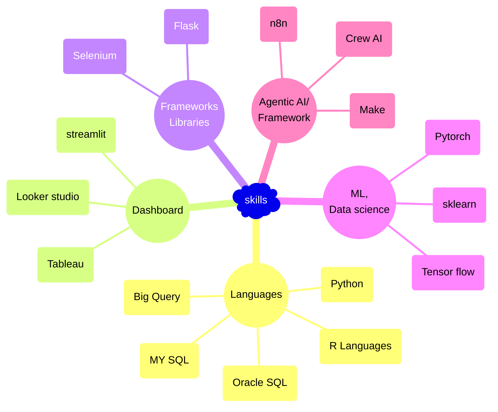

## 👨‍💼 Tinku Biswas 👋

**`Business Intelligence` | `Data Science` | `Data science / ML` | `Gen AI` | `Agengtic AI`**

>## About Me
I am a Director of Business Intelligence in the healthcare sector, specializing in data analytics, data science, orchestration, and building AI/ML models. I am passionate about leveraging data to drive insights and support decision-making processes in healthcare (US RO analytics).

- 🔭 I’m currently working on `Computer vision projects`
- 🌱 I’m currently learning `Deep learning`
- 😄 Pronouns: `He/Him`
- 📫 How to reach me: [`LinkedIn`](https://www.linkedin.com/in/tinku-biswas/) [`Email`](tinku_biswas@outlook.com)
 

>## 📔 Projects
<table>
    <tr>
        <td>
            <a href="https://github.com/Biswas-Tinku/ML_Projects"><strong>ML Projects</strong></a> 
            This repository contains all the machine learning relating to regression and classification based problems. It contains project based on both supervised and unsupervised learning. 
              <ul>
                  <li style="font-size: 14px; color: blue;">
                    <em >
                      Desc1
                    </em>
                  </li>
                  <li style="font-size: 14px; color: green;">
                    Desc1
                  </li>
                  <li style="font-size: 14px; color: orange;">
                    Desc1
                  </li>
              </ul> 
            
              Tags: ML Algorithm | EDA
             
        </td>
        <td>
            <a href="https://github.com/Biswas-Tinku/Automation"><strong>Automation Projects</strong></a> 
            This repository contains all process related automation projects. 
            The automation are tipically done on python code and libraries and a UI interface is built on the top for easy ascessibility to user. 
              <ul>
                  <li><em>Process automation is code on python with a UI layer built on top using Tkinter</em></li>
                  <li><em>Interactive dashboard that can be hosted on a web server built on using Steamlit</em></li>
                  <li><em>A web scrapping bot is buil using beautiful soup and selenuim with a user interface to authenticate using the user credentials </em></li>
                  <!--<li><em></em></li> -->
              </ul>
            
              Tags: Automation | Pandas | Tkinter | Steamlit | Selenium | Beautifulsoup
             
        </td>
    </tr>
    <tr>
        <td>
            <a href="https://github.com/Biswas-Tinku/AI_Projects"><strong>AI Projects</strong></a> 
            This repository contains AI project and AI agent. The project are created using LLM's and other AI agents.
             <ul>
                  <li><em>Levraging the power of LLM's to built AI agent to simplify complex problems</em></li>
                  <!-- <li><em></em></li>
                  <li><em>A web scrapping bot is buil using beautiful soup and selenuim with a user interface to authenticate using the user credentials </em></li>
                  <li><em></em></li> -->
              </ul>
            
              Tags: LLM | Gemini | Agents
             
        </td>
        <td>
            <a href="https://github.com/Biswas-Tinku/DL_Projects"><strong>Deep learning</strong></a> 
            This repository contains all the project which are leveraging the power of artifical neural network in object identification. These project are more towards the computer vision and image identification, these concept can be utilized in various fields in developing better AI system and gagets, assist in security enhancement, self driving and object identifications etc.
         <ul>
              <li><em>Image idenfification using Artifical neural network and Convolutional neural network</em></li>
              <li><em>Object identification from custom dataset using pre trained model using Transfer learning technique</em></li>
              <!--<li><em></em></li> -->
         </ul>
         
              Tags: ANN | CNN | RNN | Neural Network | Computer Vision | Tensor Flow | ResNet | VGG | MobileNet
          
        </td>
    </tr>
</table>

>## 🧰 Languages and Tools

  #### Programming Languages
  
  
  
  
   
  
  #### Data Science Libraries
  
  
  
  
  
  
  
   
  
  #### Visualization Tools
  
  
  
   
  
  #### Other Workflow Tools
  
  
  
  
  
   

>## 🛠️ Skills

>## 👨‍🎓 Qualifications & Certification

- **Education:**
  - Postgraduate Degree in Data Science from Manipal University (Persuing)
  - Graduation Degree in Physic from Gauwahati University
<!--
- **Certification:** 
  - Certified by GeeksforGeeks in Data Structures & Algorithms -->

>## :electron: Interests
Outside of my professional life, I have a keen interest in:
- *Electronics*
- *Astrophysics*
- *Coding*

---

Thank you for visiting my profile!

<!--
**BiswasTinku/BiswasTinku** is a ✨ _special_ ✨ repository because its `README.md` (this file) appears on your GitHub profile.

Here are some ideas to get you started:

- 🔭 I’m currently working on ...
- 🌱 I’m currently learning ...
- 👯 I’m looking to collaborate on ...
- 🤔 I’m looking for help with ...
- 💬 Ask me about ...
- 📫 How to reach me: ...
- 😄 Pronouns: ...
- ⚡ Fun fact: ...

[Tinku's GitHub stats](https://github-readme-stats.vercel.app/api?username=BiswasTinku&show_icons=true&theme=radical)

  
  
  
  

-->

